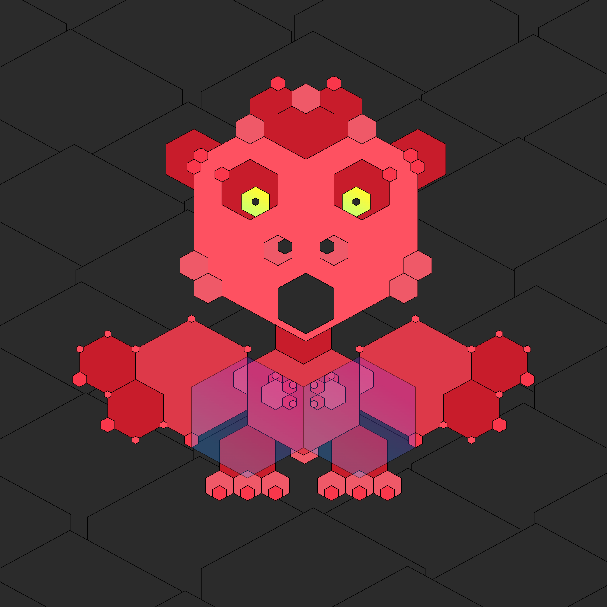

# Theta

A red baby dragoness, born in the depths of the ZERO Network.

She's a rare specimen of the Hexatesserasaurus species, with a unique body made of cascading hexagonal plates that grant her both power and flexibility.
Despite her fearsome appearance, Theta is a peaceful creature.
One day, she'll learn to breathe fire — not to frighten, but to warm our hearts.

Her cave is her sanctuary.
It's dark, but the faint light reflected from the gems embedded in the walls keeps her pumped.

Theta has been hooked on synthwave funk ever since she emerged in the world of digital art.
Hardly a day goes by without her learning a new dance move.

This bright little spirit is here to sprinkle some positive vibes your way and bid a cheerful farewell to 2024!

